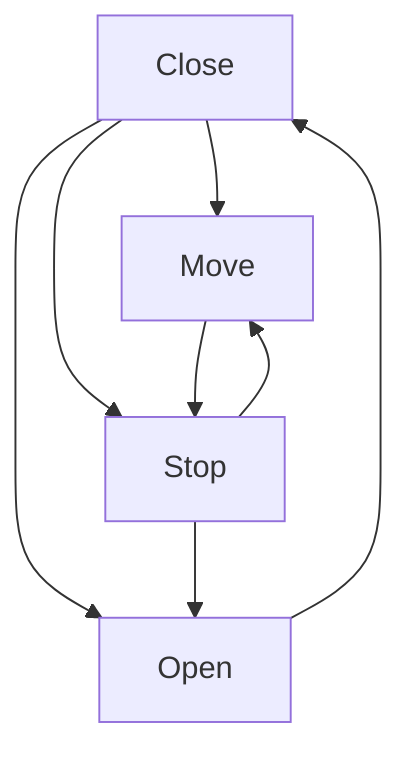

| current state/next state | open | close | move | stop |
| ------------------------ | ---- | ----- | ---- | ---- |
| open                     | x    | o     | x    | x    |
| close                    | o    | x     | o    | o    |
| move                     | x    | x     | x    | o    |
| stop                     | o    | x     | o    | x    |

